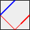
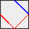

#Laserbox

An n-strength laser (a laser that has the strength to reflect exactly n-times) is deployed along one of the walls of a room containing flat, evenly spaced, randomly rotated mirrors of equal length. The walls are also themselves mirrors, and also reflect laser beams that strike them.

The corners of the room are made of absorbent materials, and striking any wall within 0.1 units of a corner will prevent the laser from reflecting any further.

Striking a mirror collinear to the laser will also stop the beam from reflecting any further.

Find the final location on a mirror or wall that the laser points to.

##Input

Input will consist of multiple test cases in a text file. Each line of the file will contain information relevant to a single test case, delimited by semi-colons (";"). The first section of the test case indicates the number of times the light can reflect. The next part describes the location and direction of the laser as a comma-separated pair of x-y coordinates. The remaining data are the x-y coordinates of the end-points of each mirror, beginning with the four walls of the room.

##Output

For each test case, output the final coordinates of the laser on a single line as shown in the format below. Coordinates should be rounded off to two decimal places.

##Sample Input
Note: The following sample contains only TWO lines. We wrapped the lines for print-friendliness.

    2;0.00 25.0,1.00 1.00;0.00 0.00,50.00 0.00;0.00 50.00,50.00 50.00;
      0.00 0.00,0.00 50.00;50.00 0.00,50.00 50.00
    2;50.00 25.0,-1.00 1.00;0.00 0.00,50.00 0.00;0.00 50.00,50.00 50.00;
      0.00 0.00,0.00 50.00;50.00 0.00,50.00 50.00

##Sample Output

    25.00 0.00
    25.00 0.00

##Sample Diagrams

## License

Copyright © 2013 Michael Chua

Distributed under the Eclipse Public License, the same as Clojure.
